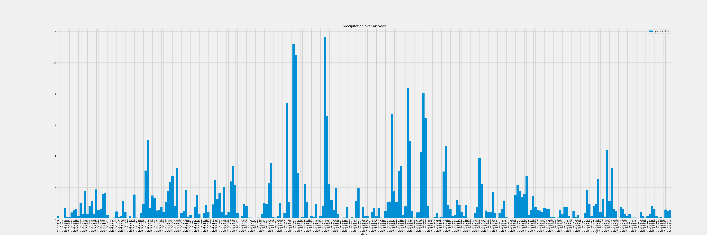
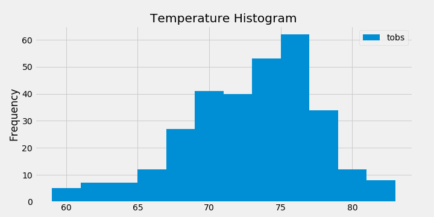
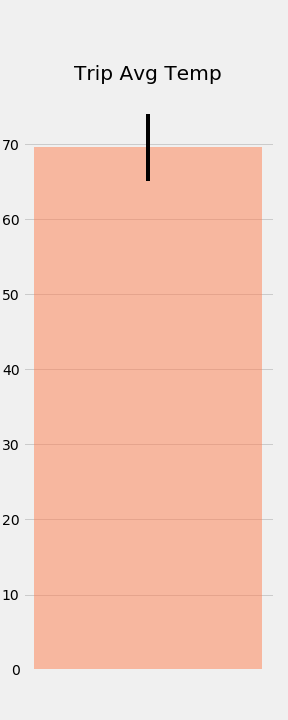

# sqlalchemy-hw

SQLAlchemy is the Python SQL toolkit and Object Relational Mapper which provides a full suite of well known enterprise-level persistence patterns, designed for efficient and high-performing database access, adapted into a simple and Pythonic domain language.

In this exercise, I took the temperature and precipitation data readings done in 9 centers across Hawaii and used it to perform weather analysis. The data was provided in sqlite format.

Below are my findings:

* The precipitation is maximum in the months of February and March as seen in the recordings.

    

* The maximum temperature goes upto 90 degress and minimum is 60 degrees. Most of the recordings were observed for 76 degrees.

    

* If I were planning a trip in the first week of March, based on the year 2011, the temperature variance I will experience can be shown with the errorbar below:

    

* In addition, the data analyzed is made available on the loacalhost through the following links once the app.py is run on localhost:
-------------------------------------------------------------------------
```
(http://127.0.0.1:5000/api/v1.0/precipitaion)
(http://127.0.0.1:5000/api/v1.0/stations)
(http://127.0.0.1:5000/api/v1.0/tobs)
(http://127.0.0.1:5000/api/v1.0/<start_date>)
(http://127.0.0.1:5000/api/v1.0/<end_date>)
```